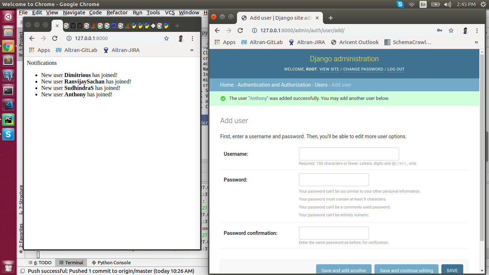

## Introduction

This is a demo repository to teach how to send asyc notification using django channels and Asynchronous Server Gateway Interface. 


## Running the application
1. Install redis server ```sudo apt install redis-server```
2. run redis server ```redis-server```
3. Clone the project to your machine ```git clone https://github.com/ranvijay-sachan/notify.git```
4. create virtual env using python3 ```virtualenv -p python3 envname```
5. activate virtual env ```source ~/envname/bin/activate``` [what is virtual env](https://docs.python.org/3/tutorial/venv.html)
6. Navigate into the diretory ```cd notify```
7. Install the dependencies ```pip install -r requirements.txt```
8. migrate database ```python manage.py migrate```
9. create superuser ```python manage.py createsuperuser```
10. Start the backend server ```python manage.py runserver```
11. Visit the application on the browser - [http:localhost:8000](http:localhost:8000)
12. open admin panel in new tab and login with superuser password - [http:localhost:8000/admin](http:localhost:8000/admin) 
13. Create a new new user through django admin,Now you can see user creation notification on home page.



